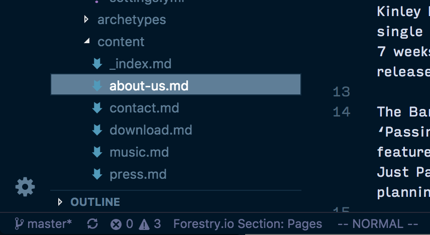

# forestry-vscode

This is a VSCode Extension for working with repositories managed by the Forestry.io Content Mangement System.

## Features 🚀

Have an idea? [Open a Feature Request](https://github.com/forestryio/forestry-vscode/issues/new?template=feature_request.md)

### Snippets

#### YAML

- `f.fmt`: Generate Front Matter Template
- `f.text`: Insert a Text field
- `f.textarea`: Insert a plain Textarea field
- `f.wysiwyg`: Insert a wysiwyg Textarea field
- `f.toggle`: Insert a Toggle field
- `f.num`: Insert a Number field

### Status Bar

- **Currenct Section:** A status bar item will display the Forestry Section where that a Markdown file lives.

## Settings ️️⚙️

This extension contributes the following settings:

- `forestry.pathToSettings`: the path to the settings file. Default: `.forestry`

## Known Issues 🐛

_None_

Did you find a problem? [Open an Issue](https://github.com/forestryio/forestry-vscode/issues/new?template=bug_report.md)

## Roadmap 👷‍

A tentative list of future features:

- Full snippet support for creating [Front Matter Templates](https://forestry.io/docs/settings/front-matter-templates/) and adding [Fields](https://forestry.io/docs/settings/fields/)
- Front Matter Templates
  - Go to the FMT of the current file.
  - Validate a file's front matter using it's FMT
- Team Support
  - See who's editing which files in Forestry
  - See which files have uncommitted changes in Forestry.

## Pairs Well With 🍷

- [Hugo Language and Syntax Support](https://marketplace.visualstudio.com/items?itemName=budparr.language-hugo-vscode)

## Slack Channel 💬

Join the [#vscode](https://forestry.io/blog/join-our-slack-community/) channel in the Forestry.io community Slack group!
